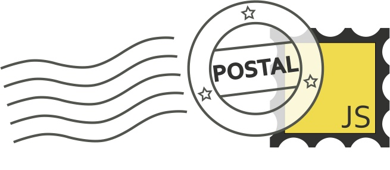

# Postal.js



[](https://travis-ci.org/postaljs/postal.js)

## Version 2.0.5 ([MIT](http://www.opensource.org/licenses/mit-license))

> See the [changelog](https://github.com/postaljs/postal.js/blob/master/changelog.md) for information on if the current version of postal has breaking changes compared to any older version(s) you might be using. Version 0.11+ removed the dependency on ConduitJS and significantly improved publishing performance. Version 1.0+ added an optional embedded-and-customized-lodash build.

## What is it?
Postal.js is an in-memory message bus - very loosely inspired by [AMQP](http://www.amqp.org/) - written in JavaScript. Postal.js runs in the browser, or on the server using node.js. It takes the familiar "eventing-style" paradigm (of which most JavaScript developers are familiar) and extends it by providing "broker" and subscriber implementations which are more sophisticated than what you typically find in simple event emitting/aggregation.

## Usage - at a glance
If you want to subscribe to a message, you tell postal what channel and topic to listen on (channel is optional, as postal provides a default one if you don't), and a callback to be invoked when a message arrives:

```javascript
	var subscription = postal.subscribe({
		channel: "orders",
		topic: "item.add",
		callback: function(data, envelope) {
			// `data` is the data published by the publisher.
			// `envelope` is a wrapper around the data & contains
			// metadata about the message like the channel, topic,
			// timestamp and any other data which might have been
			// added by the sender.
		}
	});
```

The publisher might do something similar to this:

```javascript
	postal.publish({
	    channel: "orders",
	    topic: "item.add",
	    data: {
	        sku: "AZDTF4346",
	        qty: 21
	    }
	});
```

### Channels? WAT?
A channel is a logical partition of topics. Conceptually, it's like a dedicated highway for a specific set of communication. At first glance it might seem like that's overkill for an environment that runs in an event loop, but it actually proves to be quite useful. Every library has architectural opinions that it either imposes or nudges you toward. Channel-oriented messaging nudges you to separate your communication by bounded context, and enables the kind of fine-tuned visibility you need into the interactions between components as your application grows.

While the above code snippets work just fine, it's possible to get a more terse API if you want to hang onto an `ChannelDefinition` instance - which is really a convenience wrapper around publishing and subscribing on a specific channel (instead of having to specify it each time):

```javascript
	var channel = postal.channel("orders");

	var subscription = channel.subscribe("item.add", function(data, envelope) {
		/*do stuff with data */
	});

	channel.publish("item.add", {
        sku: "AZDTF4346",
        qty: 21
    });
```

###But Wait - How's This Different Than {Insert "X" Eventing Library Here}?

* postal is not an event emitter - it's not meant to be mixed into an instance. Instead, it's a stand alone "broker" – a *message bus*.
* postal uses an *envelope* to pass messages. This means you get a consistent method signature in ALL of your subscriber callbacks. Most eventing libs take what I call the "0-n args approach", and what gets passed to the subscriber in those libs is solely at the mercy/whim of the developer that wrote the code emitting the event.
* Most "event aggregator" libs are *single channel* - which can lead to event name collision, and reduce the performance of matching an event to the correct subscribers. postal is *multi-channel*.
* postal's design *strongly discourages publishing behavior (functions/methods)*! This is intentional. In an observer-subject scenario, it's common to pass callbacks on the event data. This is an anti-pattern when it comes to messaging (and I'd argue is often an anti-pattern even in Observer pattern scenarios). A postal envelope should be *serializable* and then *de-serializable with no loss of fidelity*.
* postal can work across frame and web worker boundaries (by utilizing the [postal.federation](https://github.com/postaljs/postal.federation) and [postal.xframe](https://github.com/postaljs/postal.xframe) plugins).
* postal's built-in topic logic supports hierarchical wildcard topic bindings - supporting the same logic as topic bindings in the AMQP spec. And if you don't like that approach, you can easily provide your own bindings resolver.

## Why would I use it?
Using a local message bus can enable to you de-couple your web application's components in a way not possible with other 'eventing' approaches. In addition, strategically adopting messaging at the 'seams' of your application (e.g. - between modules, at entry/exit points for browser data and storage) can not only help enforce better overall architectural design, but also insulate you from the risks of tightly coupling your application to 3rd party libraries.  For example:

* If you're using a client-side binding framework, and either don't have - or don't like - the request/communication abstractions provided, then grab a library like [amplify.js](http://amplifyjs.com) or [reqwest](https://github.com/ded/reqwest). Then, instead of tightly coupling them to your application, have the request success/error callbacks publish messages with the appropriate data and any subscribers you've wired up can handle applying the data to the specific objects/elements they're concerned with.
* Do you need two view models to communicate, but you don't want them to need to know about each other? Have them subscribe to the topics about which they are interested in receiving messages. From there, whenever a view model needs to alert any listeners of specific data/events, just publish a message to the bus. If the other view model is present, it will receive the notification.
* Want to wire up your own binding framework? Want to control the number of times subscription callbacks get invoked within a given time frame? Want to keep subscriptions from being fired until after data stops arriving? Want to keep events from being acted upon until the UI event loop is done processing other events? Postal.js gives you the control you need in these kinds of scenarios via the options available on the `SubscriptionDefinition` object.
* postal.js is extensible. Plugins like [postal.when](https://github.com/postaljs/postal.when) can be included to provide even more targeted functionality to subscribers. [Postal.federation](https://github.com/postaljs/postal.federation) provides the core bits needed to federate postal instances running in different environments (currently the only federation plugin available is [postal.xframe](https://github.com/postaljs/postal.xframe) for federating between windows in the browser, but more plugins are in the works). These - and more - are all things Postal can do for you.

## Philosophy
Dang - you've read this far! AMAZING! If I had postal t-shirts, I'd send you one!

These four concepts are central to postal:

* channels should be provided to allow for logical partitioning of "topics"
* topics should be hierarchical and allow plain string or wildcard bindings
* messages should include envelope metadata
* subscriber callbacks should get a consistent method signature

Most eventing libraries focus on providing Observer Pattern utilities to an instance (i.e. - creating an event emitter), OR they take the idea of an event emitter and turn it into an event aggregator (so a single channel, stand alone emitter that acts as a go-between for publishers and subscribers). I'm a big fan of the Observer Pattern, but its downside is that it requires a direct reference to the subject in order to listen to events. This can become a big source of tight coupling in your app, and once you go down that road, your abstractions tend to leak, if not hemorrhage.

postal is *not* intended to replace Observer pattern scenarios. Inside a module, where it makes sense for an observer to have a direct reference to the subject, by all means, use the Observer pattern. However - when it comes to inter-module communication (view-to-view, for example), inter-library communication, cross frame communication, or even hierarchical state change notifications with libraries like ReactJS, postal is the glue to help your components communicate without glueing them with tight coupling.

### Hierarchical Topics
In my experience, seeing publish and subscribe calls all over application logic is usually a strong code smell. Ideally, the majority of message-bus integration should be concealed within application infrastructure. Having a hierarchical-wildcard-bindable topic system makes it very easy to keep things concise (especially subscribe calls!). For example, if you have a module that needs to listen to every message published on the ShoppingCart channel, you'd simply subscribe to "\#", and never have to worry about additional subscribes on that channel again - even if you add new messages in the future. If you need to capture all messages with ".validation" at the end of the topic, you'd simply subscribe to "\#.validation". If you needed to target all messages with topics that started with "Customer.", ended with ".validation" and had only one period-delimited segment in between, you'd subscribe to "Customer.*.validation" (thus your subscription would capture Customer.address.validation and Customer.email.validation").

## More on How to Use It

Here are four examples of using Postal. All of these examples - AND MORE! - can run live [here](http://jsfiddle.net/ifandelse/8dLpkpcf/). Be sure to check out the [wiki](https://github.com/postaljs/postal.js/wiki) for API documentation and conceptual walk-throughs.

```javascript
// This gets you a handle to the default postal channel...
// For grins, you can get a named channel instead like this:
// var channel = postal.channel( "DoctorWho" );
var channel = postal.channel();

// subscribe to 'name.change' topics
var subscription = channel.subscribe( "name.change", function ( data ) {
	$( "#example1" ).html( "Name: " + data.name );
} );

// And someone publishes a name change:
channel.publish( "name.change", { name : "Dr. Who" } );

// To unsubscribe, you:
subscription.unsubscribe();

// postal also provides a top-level ability to subscribe/publish
// used primarily when you don't need to hang onto a channel instance:
var anotherSub = postal.subscribe({
	channel  : "MyChannel",
	topic    : "name.change",
	callback : function(data, envelope) {
		$( "#example1" ).html( "Name: " + data.name );
	}
});

postal.publish({
	channel : "MyChannel",
	topic   : "name.change",
	data    : {
	    name : "Dr. Who"
	}
});
```

### Subscribing to a wildcard topic using *

The `*` symbol represents "one word" in a topic (i.e - the text between two periods of a topic). By subscribing to `"*.changed"`, the binding will match `name.changed` & `location.changed` but *not* `changed.companion`.

```javascript
var chgSubscription = channel.subscribe( "*.changed", function ( data ) {
	$( "<li>" + data.type + " changed: " + data.value + "</li>" ).appendTo( "#example2" );
} );
channel.publish( "name.changed",     { type : "Name",     value : "John Smith" } );
channel.publish( "location.changed", { type : "Location", value : "Early 20th Century England" } );
chgSubscription.unsubscribe();
```

### Subscribing to a wildcard topic using &#35;

The `#` symbol represents 0-n number of characters/words in a topic string. By subscribing to `"DrWho.#.Changed"`, the binding will match `DrWho.NinthDoctor.Companion.Changed` & `DrWho.Location.Changed` but *not* `Changed`.

```javascript
var starSubscription = channel.subscribe( "DrWho.#.Changed", function ( data ) {
	$( "<li>" + data.type + " Changed: " + data.value + "</li>" ).appendTo( "#example3" );
} );
channel.publish( "DrWho.NinthDoctor.Companion.Changed", { type : "Companion Name", value : "Rose"   } );
channel.publish( "DrWho.TenthDoctor.Companion.Changed", { type : "Companion Name", value : "Martha" } );
channel.publish( "DrWho.Eleventh.Companion.Changed",    { type : "Companion Name", value : "Amy"    } );
channel.publish( "DrWho.Location.Changed",              { type : "Location",       value : "The Library" } );
channel.publish( "TheMaster.DrumBeat.Changed",          { type : "DrumBeat",       value : "This won't trigger any subscriptions" } );
channel.publish( "Changed",                             { type : "Useless",        value : "This won't trigger any subscriptions either" } );
starSubscription.unsubscribe();
```


### Applying distinctUntilChanged to a subscription

```javascript
var dupChannel = postal.channel( "Blink" ),
    dupSubscription = dupChannel.subscribe( "WeepingAngel.#", function( data ) {
                          $( '<li>' + data.value + '</li>' ).appendTo( "#example4" );
                      }).distinctUntilChanged();
// demonstrating multiple channels per topic being used
// You can do it this way if you like, but the example above has nicer syntax (and *much* less overhead)
dupChannel.publish( "WeepingAngel.DontBlink", { value:"Don't Blink" } );
dupChannel.publish( "WeepingAngel.DontBlink", { value:"Don't Blink" } );
dupChannel.publish( "WeepingAngel.DontEvenBlink", { value:"Don't Even Blink" } );
dupChannel.publish( "WeepingAngel.DontBlink", { value:"Don't Close Your Eyes" } );
dupChannel.publish( "WeepingAngel.DontBlink", { value:"Don't Blink" } );
dupChannel.publish( "WeepingAngel.DontBlink", { value:"Don't Blink" } );
dupSubscription.unsubscribe();
```

## More References
Please visit the [postal.js wiki](https://github.com/postaljs/postal.js/wiki) for API documentation, discussion of concepts and links to blogs/articles on postal.js.

## How can I extend it?
There are four main ways you can extend Postal:

* Write a plugin. Need more complex behavior that the built-in SubscriptionDefinition doesn't offer? Write a plugin that you can attach to the global postal object. See [postal.when](https://github.com/postaljs/postal.when) for an example of how to do this. You can also write plugins that extend the `ChannelDefinition` and `SubscriptionDefinition` prototypes - see [postal.request-response](https://github.com/postaljs/postal.request-response) for an example of this.
* Write a custom federation plugin, to federate instances of postal across a transport of your choice.
* You can also change how the `bindingResolver` matches subscriptions to message topics being published. You may not care for the AMQP-style bindings functionality. No problem! Write your own resolver object that implements a `compare` and `reset` method and swap the core version out with your implementation by calling: `postal.configuration.resolver = myWayBetterResolver`.

It's also possible to extend the monitoring of messages passing through Postal by adding a "wire tap". A wire tap is a callback that will get invoked for any published message (even if no actual subscriptions would bind to the message's topic). Wire taps should _not_ be used in lieu of an actual subscription - but instead should be used for diagnostics, logging, forwarding (to a websocket publisher or a local storage wrapper, for example) or other concerns that fall along those lines. This repository used to include a console logging wiretap called postal.diagnostics.js - you can now find it [here in it's own repo](https://github.com/postaljs/postal.diagnostics). This diagnostics wiretap can be configured with filters to limit the firehose of message data to specific channels/topics and more.

## Build, Dependencies, etc.

* postal depends on [lodash.js](http://lodash.com/)
    * The standard postal build output (`lib/postal.js`) is what you would normally use if you're already using lodash in your app.
    * The `lib/postal.lodash.js` build output might be of interest to you if these things are true:
        * You're using webpack, browserify or another bundler/loader capable of loading CommonJS modules.
        * You only need the specific bits of lodash used by postal and don't need the full lib.
* postal uses [gulp.js](http://gulpjs.com/) for building, running tests and examples.
	* To build
        * run `npm install` (to install all deps)
        * run `bower install` (yep, we're using at least one thing only found on bower in the local project runner)
        * run `npm run build` (this is just an alias for `gulp` at the moment, which you can also use) - then check the lib folder for the output
    * To run tests & examples
        * Tests are node-based: `npm test` (or `npm run test-lodash` to test the custom lodash build output)
        * To run browser-based examples:
            * run `npm start`
            * navigate in your browser to <http://localhost:3080/>
            * if you want to see test coverage or plato reports be sure to run `npm run coverage` and `gulp report` (respectively) in order to generate them, as they are not stored with the repo.


## Can I contribute?
Please - by all means! While I hope the API is relatively stable, I'm open to pull requests.  (Hint - if you want a feature implemented, a pull request gives it a much higher probability of being included than simply asking me.) As I said, pull requests are most certainly welcome - but please include tests for your additions. Otherwise, it will disappear into the ether.
