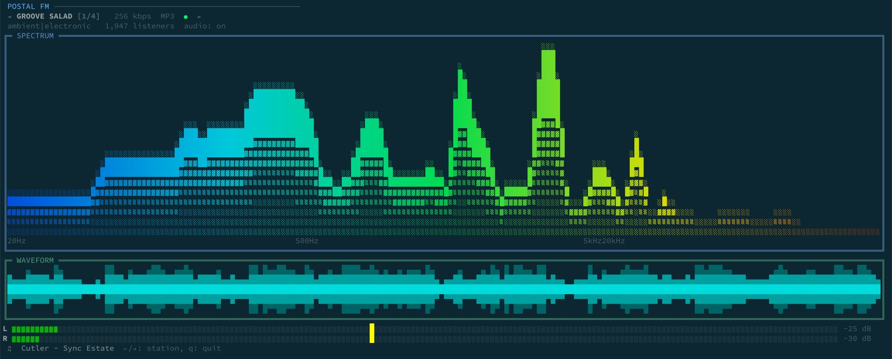

# radio-spectrum-tui

A terminal internet radio visualizer built with [Ink](https://github.com/vadimdemedes/ink)/React. Streams SomaFM, decodes audio in real time, and renders a spectrum analyzer, scrolling waveform, and stereo VU meters — all coordinated through postal's pub/sub messaging over Node.js child process IPC.

> **SomaFM** is a non-profit, listener-supported internet radio service. Streams are public Icecast HTTP — no auth, no API key required. Support them at [somafm.com/support](https://somafm.com/support).

## What it looks like



## Requirements

- **ffmpeg** in PATH — decodes Icecast MP3 streams to raw PCM
    - macOS: `brew install ffmpeg`
    - Ubuntu/Debian: `apt install ffmpeg`
- **sox** (optional) — audio playback, only needed with `--play`
    - macOS: `brew install sox`
    - Ubuntu/Debian: `apt install sox`

## Usage

```bash
# From the repo root:
pnpm --filter @postal-examples/radio-spectrum-tui start

# With audio output (requires sox):
pnpm --filter @postal-examples/radio-spectrum-tui start -- --play

# Watch mode (tsx reloads on file change):
pnpm --filter @postal-examples/radio-spectrum-tui dev
```

### Keys

| Key            | Action                  |
| -------------- | ----------------------- |
| `←` / `→`      | Previous / next station |
| `q` / `Ctrl+C` | Quit                    |

## How it works

The app is built as a parent process (the Ink/React TUI) and four child processes, all coordinated through `postal-transport-childprocess`. The parent doesn't do any audio processing itself — it renders the UI and shuttles messages between children.

### The child processes

**stream-reader** is the workhorse. It opens an HTTP connection to a SomaFM Icecast stream, pipes the MP3 response through `ffmpeg` to decode it into raw PCM (signed 16-bit LE, 44100 Hz, stereo), and publishes the decoded audio as base64-encoded chunks on `radio.audio.pcm`. If `--play` is active, it also pipes the raw PCM bytes to a `sox play` subprocess for audio output. When you switch stations, it tears down the HTTP connection, kills ffmpeg, and starts a fresh pipeline.

**spectrum-worker** subscribes to `radio.audio.pcm`, decodes each chunk, runs an FFT (Hann window → magnitude spectrum), maps the result onto 64 log-spaced frequency bins (20 Hz – 20 kHz), applies exponential smoothing for smooth decay, and publishes the normalized bin values on `radio.viz.spectrum`.

**waveform-worker** also subscribes to `radio.audio.pcm`. It downsamples each chunk into two columns of peak amplitude data for the scrolling waveform display (`radio.viz.waveform`) and computes per-channel RMS + peak-hold levels for the VU meters (`radio.viz.levels`).

**metadata-worker** doesn't touch audio at all. It polls the SomaFM channels API every 30 seconds and publishes station metadata (genre, listener count, current track) on `radio.station.meta`. It listens for `radio.control.tune` to know which station to fetch.

### Message flow

```
┌──────────────────────────────────────────────────────────────────┐
│  PARENT (Ink TUI)                                                │
│                                                                  │
│  publishes:                                                      │
│    radio.control.tune  → all children    (station change)        │
│    radio.control.audio → stream-reader   (enable playback)       │
│    radio.control.quit  → all children    (shutdown)              │
│    radio.audio.pcm     → viz workers     (PCM relay, see below) │
│                                                                  │
│  subscribes to:                                                  │
│    radio.viz.spectrum   (spectrum-worker → SpectrumPane)         │
│    radio.viz.waveform   (waveform-worker → WaveformPane)         │
│    radio.viz.levels     (waveform-worker → VuMeters)             │
│    radio.station.meta   (metadata-worker → Header + Footer)      │
└──────────────────────────────────────────────────────────────────┘
       │           │           │           │
  stream-reader  spectrum-   waveform-   metadata-
  (HTTP+ffmpeg)  worker      worker      worker
                 (FFT)       (VU/wave)   (SomaFM API)
```

### PCM relay — why the parent re-publishes audio data

Each child process has its own IPC transport connection to the parent. When stream-reader publishes `radio.audio.pcm`, it arrives at the parent via one transport — but postal doesn't automatically re-broadcast inbound messages to other transports. The spectrum and waveform workers are on separate transport connections, so the parent must explicitly re-publish the PCM data so they receive it.

A source guard prevents infinite loops: the parent only relays messages that arrived from a transport (have a `source` field), not messages it published itself.

```ts
channel.subscribe("radio.audio.pcm", envelope => {
    if (envelope.source) {
        channel.publish("radio.audio.pcm", envelope.payload);
    }
});
```

## On the base64 elephant in the room

Yes, base64-encoding binary PCM data into JSON strings and sending it through Node's IPC serialization is not how you'd build a production audio pipeline. It's roughly 33% overhead on the wire, and the encode/decode cycle burns CPU that could be spent on actual DSP.

We did it anyway because:

1. **It demonstrates postal's child process transport doing real work.** The point of this example is showing pub/sub message coordination across processes — stream-reader publishes audio, spectrum-worker and waveform-worker subscribe to it, metadata-worker does its own thing, and the parent orchestrates all of it. The messaging pattern matters more than the encoding.

2. **It's actually fine for this use case.** At ~21 chunks/second and ~11 KB of base64 per chunk, the throughput is around 230 KB/s. Node's IPC channel handles that without breaking a sweat. The FFT math in spectrum-worker is more expensive than the base64 decode.

3. **The "right" way exists in postal too.** If you need zero-copy binary transfer, `postal-transport-messageport` with `worker_threads` and `SharedArrayBuffer` is the path. Different transport, same pub/sub API. That's the whole point of postal's transport abstraction — swap the plumbing, keep the messaging.

## Component tree

```
<App>
  ├── useChildProcesses()      — fork, connect, and clean up the four children
  ├── usePostalSubscription()  — bridge postal topics into React state (×4)
  ├── useBusActivity()         — wiretap flash for the activity dot
  ├── <Header>                 — station name, bitrate, nav arrows, activity dot
  ├── <SpectrumPane>           — frequency spectrum bars
  ├── <WaveformPane>           — scrolling amplitude envelope
  ├── <VuMeters>               — L + R VU meter bars
  └── <Footer>                 — current track, key hints
```
